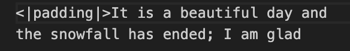
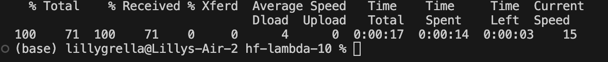
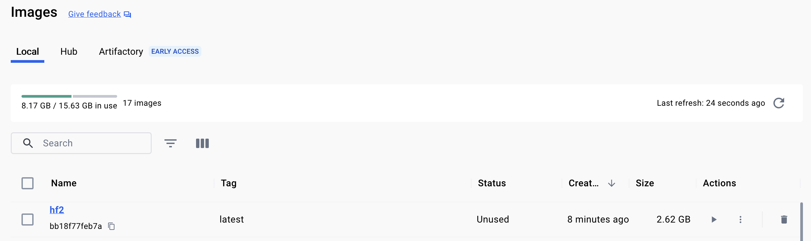
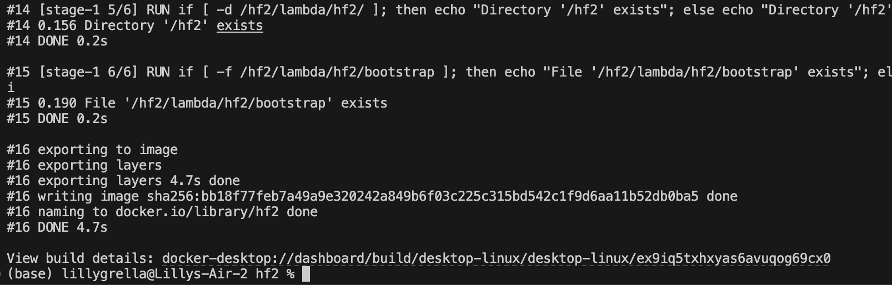
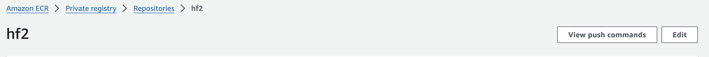
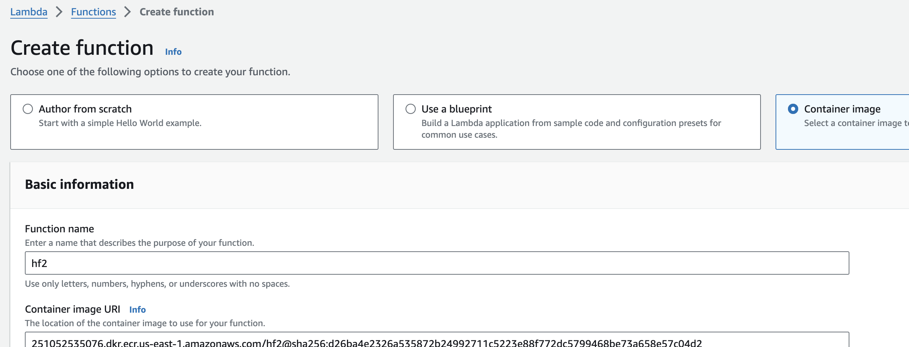
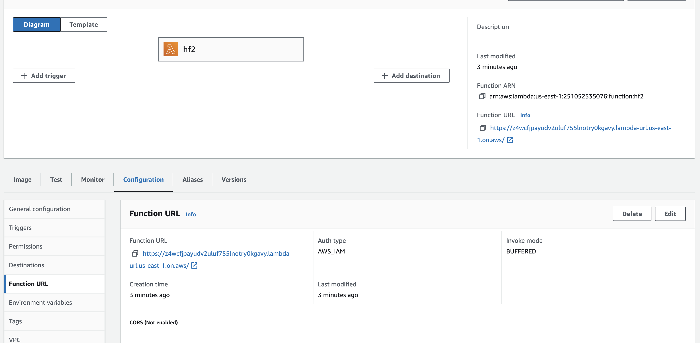

# Mini Project 10

## Dockerize Rust Transformer and Deploy to AWS Lambda

## Installation and Dependencies
* Download model of interest, I chose Pythia 1b for size constraints and speed
* Install Rust, Cargo (Lambda), and AWS CLI
* Run cargo lambda new {project name} to initiate a lambda project
* add dependencies to Cargo.toml file (including `llm = { git = "https://github.com/rustformers/llm" , branch = "main" }` for access to transformer

## Using Rust Transformer
* Using code catalyst I created a main.rs script that takes user input (the start of a sentence) and outputs the rest of the sentence up to 10 additional words.

## Quality Check
* To confirm the program runs as expected, run cargo lambda watch
* In a separate terminal, run: `curl http://localhost:9000/default/<{projectname}>\?text="{beginningofsentence}"`

## AWS ECR
* To start in AWS console, navigate to ECR page and create a new private repository
* Run the following to connect AWS with docker: `aws ecr get-login-password --region us-east-1 | docker login --username AWS --password-stdin {AWSacctnum}.dkr.ecr.us-east-1.amazonaws.com`
* Build docker image: `docker buildx build --progress=plain --platform linux/arm64 -t {projectname} .`
* Tag the docker image: `docker tag {projectname}:latest {AWSacctnum}.dkr.ecr.us-east-1.amazonaws.com/{projectname}:latest`
* Push docker image to ECR: `docker push {AWSacctnum}.dkr.ecr.us-east-1.amazonaws.com/{projectname}:latest`

## AWS Lambda
* Navigate to Lambda Page
* Create a new Lambda function (make sure to select container image and arm64 architecture!)
* Create a new functional URL
* run the curl line from above, but replace the localhost url with the functional url from the lambda function

## Output

## Screenshots

